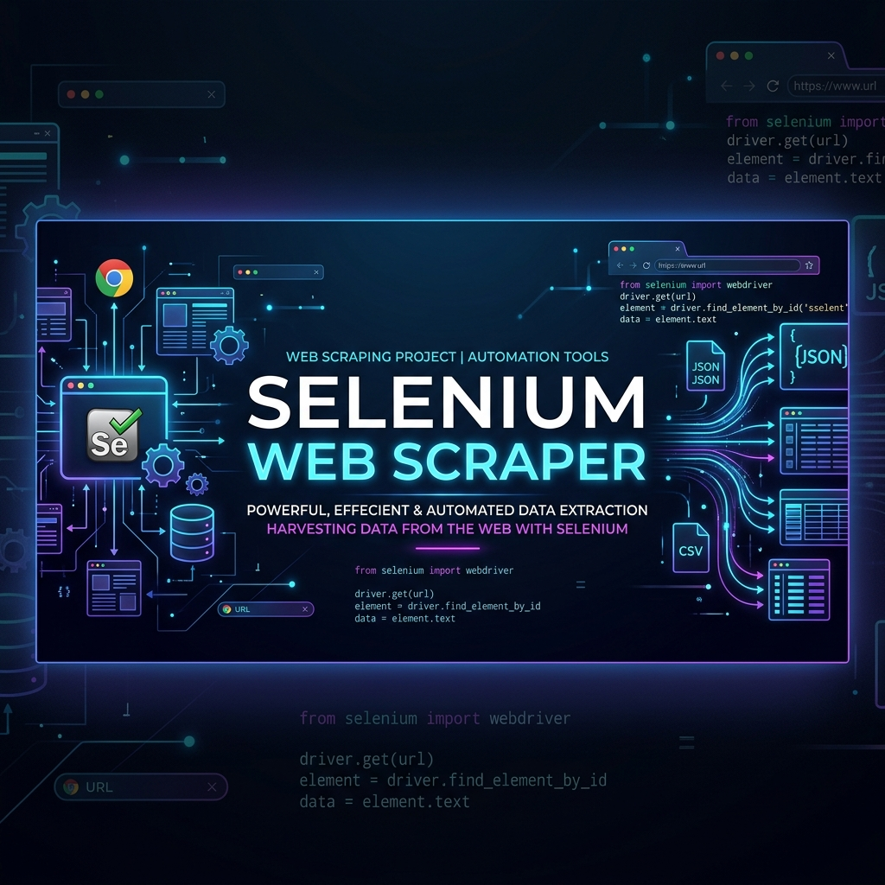

# Selenium Web Scraper (Java)



A clean, modern Java-based web scraping template built with **Selenium WebDriver** and **JUnit 4**. This project is designed as a starting point for writing robust, browser-automated scrapers. It includes configurations and templates specifically tailored for scraping game data (titles, prices, and base prices) from e-commerce sites like **GOG.com**.

---

## 🚀 Key Features

*   **Browser Automation**: Powered by Selenium WebDriver to interact with dynamic, JavaScript-rendered web pages.
*   **Structured Template**: Contains dedicated templates for target scrapers (`GameScraper`) separate from the application entry point.
*   **Testing Infrastructure**: Pre-configured with JUnit 4 for writing automated verification tests for scrapers.
*   **IntelliJ Ready**: Out-of-the-box support for IntelliJ IDEA projects using `.iml` configurations.

---

## 📂 Repository Structure

Below is the directory tree of the key files in this repository:

```text
├── assets/
│   └── scraper_banner.png    # Repository banner image
├── src/
│   ├── GameScraper.java      # Template class for GOG.com game scraping logic
│   └── Main.java             # Main application entry point
├── WebScraper.iml            # IntelliJ IDEA module configuration (libs, source folders)
└── .gitignore                # Excludes IDE configs, build outputs, and system logs
```

*   **[src/Main.java](src/Main.java)**: Entry point for general environment testing.
*   **[src/GameScraper.java](src/GameScraper.java)**: Draft template where the Selenium scraping workflow for GOG.com should be implemented.
*   **[WebScraper.iml](WebScraper.iml)**: Project configurations including dependencies on Selenium and JUnit 4.

---

## 🛠️ Prerequisites

Ensure you have the following installed on your machine:

1.  **Java Development Kit (JDK)**: Version 21 or higher.
2.  **IntelliJ IDEA**: (Community or Ultimate edition) is highly recommended since dependencies are managed via the `.iml` project file.
3.  **Google Chrome / Firefox**: A modern web browser to run the automation scripts.
4.  **WebDrivers**: Selenium Manager (included in modern Selenium 4.x) will automatically download the correct Chrome/Firefox driver, so manual driver installation is optional.

---

## 💻 Installation & Setup

Follow these steps to set up the project locally:

### 1. Clone the Repository
```bash
git clone https://github.com/soniakshat/selenium-web-scraper-java.git
cd selenium-web-scraper-java
```

### 2. Import into IntelliJ IDEA
1. Open **IntelliJ IDEA**.
2. Select **Open** or **Import**.
3. Navigate to the `selenium-web-scraper-java` folder and select it.
4. IntelliJ will read the `WebScraper.iml` file and configure the project structure automatically.

### 3. Resolve Dependencies
If the dependencies (`seleniumhq.selenium.java` and `JUnit4`) are not automatically downloaded:
1. Open the project settings (`Cmd + ;` on macOS or `Ctrl + Alt + S` on Windows).
2. Go to **Project Structure** > **Libraries**.
3. Add `seleniumhq.selenium.java` from Maven or configure your local JAR path.

---

## 🏃 How to Run

### Running the App via IntelliJ
1. Navigate to `src/Main.java` in the project explorer.
2. Click the green **Run** play button next to the class definition or the `main` method.
3. You should see `Hello world!` printed in the console output.

### Running the Scraper
1. Add your Selenium scraping logic inside `src/GameScraper.java`.
2. Click the green **Run** play button inside `GameScraper.java` to start the browser-automation process.

---

## 🧪 Running Tests

This project is set up to run JUnit tests. 

To run tests within IntelliJ:
1. Right-click the `src` folder (or individual test classes/methods when added).
2. Select **Run 'All Tests'** or click the run icon beside the test methods.
